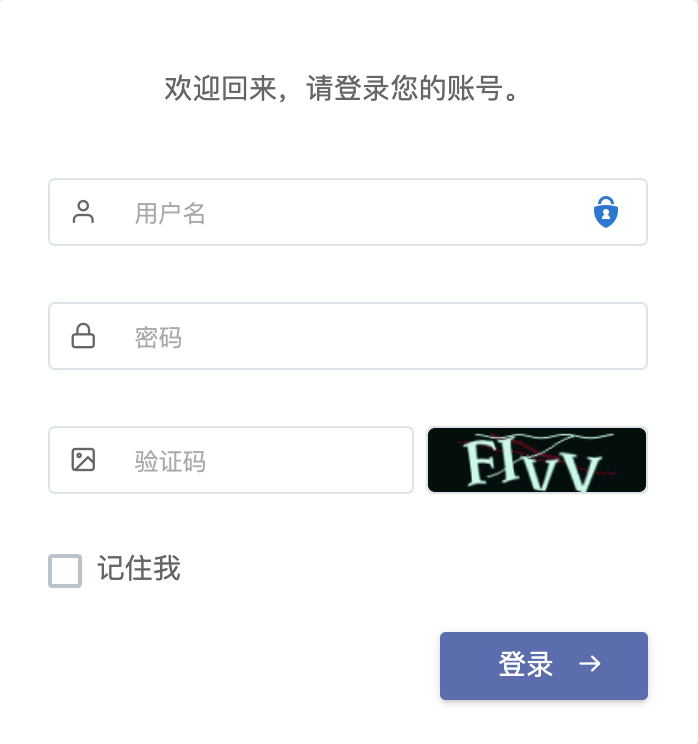
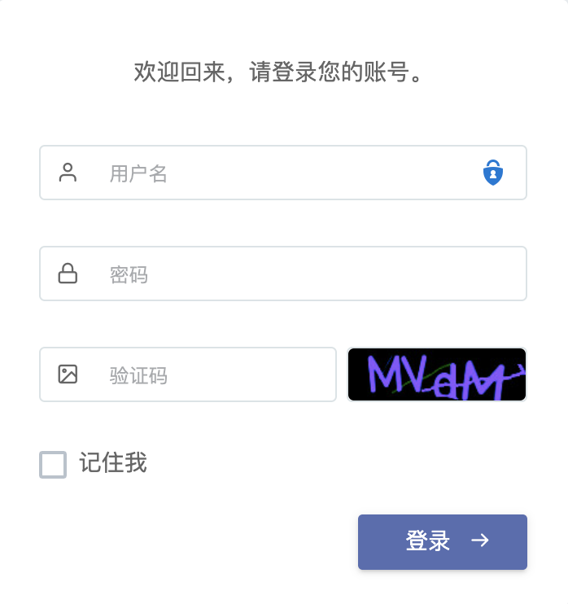

# dcat-login-captcha

[简体中文](README.md) | [ENGLISH](README-EN.md)

> dact admin login captcha. - dcat admin 登录验证码。

[](https://github.com/guanguans/dcat-login-captcha/actions)
[](https://github.com/guanguans/dcat-login-captcha/actions)
[](https://codecov.io/gh/guanguans/dcat-login-captcha)
[](//packagist.org/packages/guanguans/dcat-login-captcha)
[](//packagist.org/packages/guanguans/dcat-login-captcha)
[](//packagist.org/packages/guanguans/dcat-login-captcha)

## 环境要求

* dcat-admin >= 2.0

## 安装

### Composer 安装

``` bash
$ composer require guanguans/dcat-login-captcha -vvv
```

### 后台 -> 开发工具 -> 扩展列表

启用本扩展。

## 使用

 1 | 2 | 3
---|---|---
||

## 测试

``` bash
$ composer test
```

## 变更日志

请参阅 [CHANGELOG](CHANGELOG.md) 获取最近有关更改的更多信息。

## 贡献指南

请参阅 [CONTRIBUTING](.github/CONTRIBUTING.md) 有关详细信息。

## 安全漏洞

请查看[我们的安全政策](../../security/policy)了解如何报告安全漏洞。

## 贡献者

* [guanguans](https://github.com/guanguans)
* [所有贡献者](../../contributors)

## 协议

MIT 许可证（MIT）。有关更多信息，请参见[协议文件](LICENSE)。
