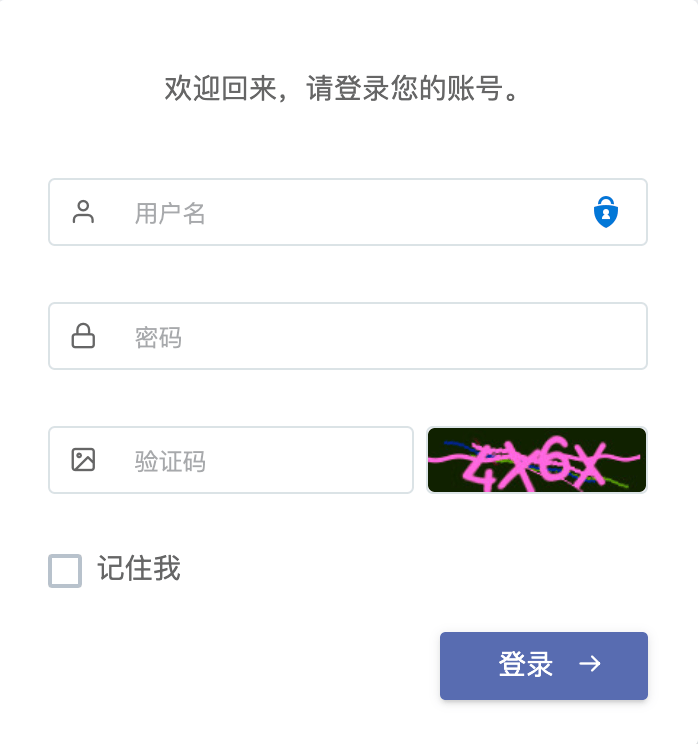
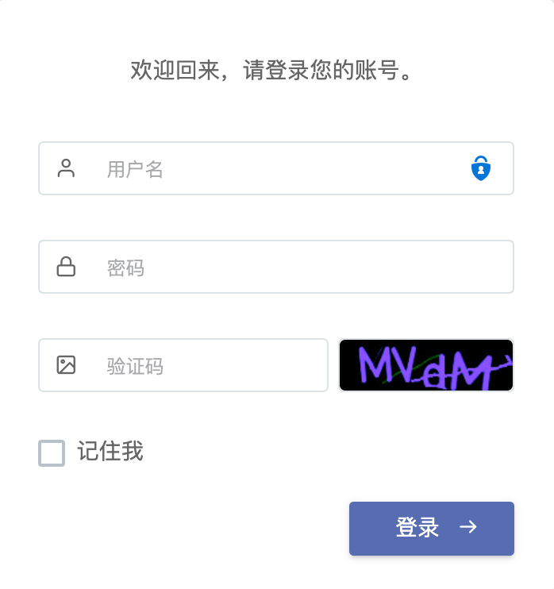

# dcat-login-captcha

[简体中文](README-zh_CN.md) | [ENGLISH](README.md)

> dact admin login captcha. - dcat admin 登录验证码。

[](https://github.com/guanguans/dcat-login-captcha/actions)
[](https://github.com/guanguans/dcat-login-captcha/actions)
[](https://codecov.io/gh/guanguans/dcat-login-captcha)
[](https://packagist.org/packages/guanguans/dcat-login-captcha)
[](https://packagist.org/packages/guanguans/dcat-login-captcha)
[](https://packagist.org/packages/guanguans/dcat-login-captcha)

## Requirement

* PHP >= 7.3
* laravel >= 7.0
* dcat-admin >= 2.0

## Installation

### Composer installation

```bash
composer require guanguans/dcat-login-captcha --prefer-source -v
```

### Backend -> Helpers -> Extensions

Enable this extension.

## View

 example 1                      | example 2                      | example 3                      
--------------------------------|--------------------------------|--------------------------------
  |  |  

## Testing

```bash
composer test
```

## Changelog

Please see [CHANGELOG](CHANGELOG.md) for more information on what has changed recently.

## Contributing

Please see [CONTRIBUTING](.github/CONTRIBUTING.md) for details.

## Security Vulnerabilities

Please review [our security policy](../../security/policy) on how to report security vulnerabilities.

## Credits

* [guanguans](https://github.com/guanguans)
* [All Contributors](../../contributors)

## License

The MIT License (MIT). Please see [License File](LICENSE) for more information.
